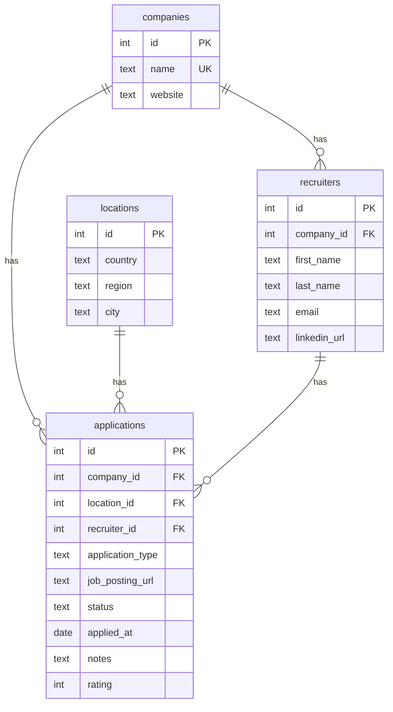

# Job Tracker

A full-stack application to track job applications during a job search. Built as a monorepo with a React frontend, Express API, and shared validation schemas.


## Features

- **Application tracking** — Log applications with company, location, date, type, notes and rating
- **Company management** — Searchable combobox with inline creation
- **Location picker** — Cascading country / region / city selectors with autocomplete
- **Recruiter contacts** — Link recruiters to companies and applications
- **Status workflow** — Draft, pending, in progress, rejected, accepted — editable inline from the table
- **Star rating** — Rate applications from 0 to 5
- **Dark mode** — System / light / dark toggle with persistence
- **Docker deployment** — Production-ready with Nginx reverse proxy

## Tech Stack

| Layer | Technologies |
|---|---|
| **Frontend** | React 19, Vite 7, Tailwind CSS 4, shadcn/ui |
| **State & Forms** | TanStack Query, TanStack Form, TanStack Table |
| **Backend** | Express 5, Drizzle ORM, better-sqlite3 |
| **Shared** | Zod 4 schemas for API validation (client + server) |
| **Tooling** | TypeScript 5.9, pnpm workspaces, Biome, Vitest, Husky |
| **Infra** | Docker multi-stage build, Nginx, docker-compose |

## Architecture

```
job-tracker/
├── app/
│   ├── api/            # Express REST API + SQLite database
│   │   ├── src/
│   │   │   ├── app/        # Express app setup & config
│   │   │   ├── db/         # Drizzle schema & migrations
│   │   │   └── routes/     # CRUD route handlers
│   │   └── .config/        # Config management system
│   ├── client/         # React SPA
│   │   └── src/
│   │       ├── components/ # Application form, table, combobox, etc.
│   │       └── lib/        # API client, theme, utilities
│   └── shared/         # Zod validation schemas & TypeScript types
├── nginx/              # Reverse proxy configuration
├── Dockerfile          # Multi-stage API build
└── docker-compose.yml  # Production deployment
```

## Data Model



## API Endpoints

| Method | Route | Description |
|---|---|---|
| `GET` | `/api/companies` | List all companies |
| `POST` | `/api/companies` | Create a company |
| `PUT` | `/api/companies/:id` | Update a company |
| `DELETE` | `/api/companies/:id` | Delete a company |
| `GET` | `/api/applications` | List all applications (with joins) |
| `POST` | `/api/applications` | Create an application |
| `PUT` | `/api/applications/:id` | Update an application |
| `DELETE` | `/api/applications/:id` | Delete an application |
| `GET` | `/api/recruiters` | List recruiters (by company) |
| `POST` | `/api/recruiters` | Create a recruiter |
| `GET` | `/api/locations/countries` | List distinct countries |
| `GET` | `/api/locations/regions` | List regions by country |
| `GET` | `/api/locations/cities` | List cities by country & region |

## Getting Started

### Prerequisites

- [Node.js](https://nodejs.org/) >= 22
- [pnpm](https://pnpm.io/) >= 10

### Development

```bash
# Install dependencies
pnpm install

# Run database migrations
pnpm --filter api run db:migrate

# Start both API and client in parallel
pnpm dev
```

The API runs on `http://localhost:3001` and the client on `http://localhost:5173`.

### Docker

```bash
# Production
docker compose up -d

# Development
docker compose -f docker-compose.dev.yml up --build
```

The app is served on `http://localhost` via Nginx.

## Available Scripts

| Command | Description |
|---|---|
| `pnpm dev` | Start API + client in parallel (hot reload) |
| `pnpm build` | Build all packages |
| `pnpm typecheck` | TypeScript type checking across all packages |
| `pnpm lint` | Lint with Biome |
| `pnpm format` | Format with Biome |
| `pnpm test` | Run tests with Vitest |
| `pnpm test:watch` | Run tests in watch mode |
